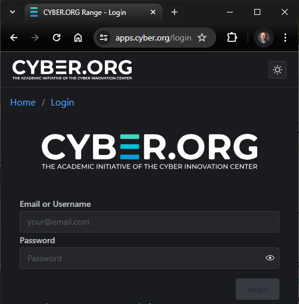
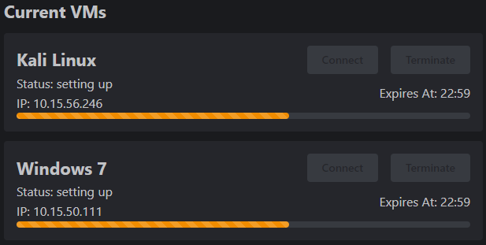
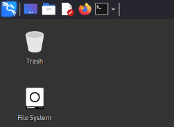
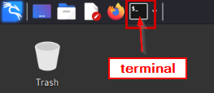
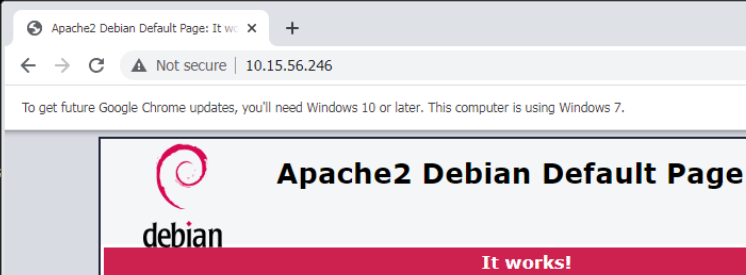

In this lab, you will serve a website from Kali. You will use a Windows virtual machine to access the website. This lab can be done from the cyber.org range.

## Acceptable Use

Virtual machines in the cyber.org range have limited internet access. Do not use the range to perform any kind of attack on any resource outside of the range. Only test on authorized targets inside the range.

## Lab Objectives

In this lab, you will:

* Log into the cyber range
* Launch Kali and Windows virtual machines (VMs)
* Switch to the root user account in Linux
* Change directories in Linux
* Create files in Linux
* Start the Apache web server in Linux
* Access the website from a Windows VM

## 1) Login

1. Navigate to <https://apps.cyber.org/login>.
2. Enter the range user name and password. (You cannot log in with your personal email.) The username and password will look something like:
    * Username: vphtfq
    * Password: xcbqf6yw



3. Open the classroom by clicking on the classroom link. (Your classroom may differ from the screenshot.)


## 2) Launch Virtual Machines

1. Click the **launch** buttons for the Kali Linux and Windows 7 virtual machines.


The virtual machines will take a few minutes to boot. You can monitor their progress.



## 3) Kali Configuration

In this section, you will configure Kali Linux to server web pages.

1. Once the Kali VM has finished booting, click **Connect**.


2. Your Kali VM will open in your browser. You have access to the Kali Linux graphical user interface.



3. Click the terminal icon to launch the terminal.



4. Note your private IP address in the terminal prompt.


5. Run the following commands.

```shell
sudo su
cd /var/www/html
echo "I am alive!" > hello.txt
systemctl start apache2
```

After entering the `sudo su` command, your terminal should look like the following:


If any of the commands give you errors, just rerun them. If everything goes well, Kali will not tell you that the commands succeeded.

These commands:

* Switch to the **root** account (which is required to write files to the `/var/www/html` directory).
* Changes directories to `/var/www/html`.
* Creates a file called `hello.txt` with the contents, "I am alive!"
* Starts the Apache web server.

Now, Kali Linux is serving a website. **Note the IP address in the terminal prompt (such as 10.15.56.246).

## 4) Windows 7 Testing

1. At the top of your web browser, click **Other Machines**.


2. Click **Connect** on the Windows 7 virtual machine.


3. Click on the desktop to close the connection popup window.
4. Open a web browser on the Windows desktop. Chrome works well, though it can be a bit slow.
5. Enter the IP address of your Kali VM in the URL. You should see the default web server homepage.



6. Add **/hello.txt** to the url. You should see the contents of the file you created on the Kali VM.


7. Right-click in the browser and choose "Save as...".


8. Choose the Desktop folder, and click Save.


9. Close the browser.
10. The "hello" text file should be on the desktop. Double-click it to open it.


## Lab Summary

In this exercise you:

* Logged into the cyber range.
* Launched a Kali Linux and a Windows virtual machine.
* Accessed the virtual machines through your web browser.
* Switched to the root account (`sudo su`).
* Changed directories (`cd /var/www/html`).
* Created files in the Kali Linux web server root (`/var/www/html`).
* Started the web server software (`systemctl start apache2`)
* Loaded your website from the Windows VM using a web browser using the Kali Linux IP address.
* Saved files to the Windows desktop.

## Challenge 1

* Create another text file in the Kali /var/www/html directory.
* Download the file in the Windows VM.

## Challenge 2

* Create an HTML file in the Kali /var/www/html directory using **nano**.
* Add several HTML elements like lists, paragraphs, and headings.
* Load the web page in the Windows VM.

## Challenge 3

* Edit hello.txt using **nano**.

```shell
nano hello.txt
```

* Reload hello.txt in the Windows VM.

## Reflection

* Is this an effective way to transfer files between computers?
* What other ways could there be to move files between computers?
* What kinds of IP addresses are used here?
* Why was it necessary to run the Linux commands with privileged access?
